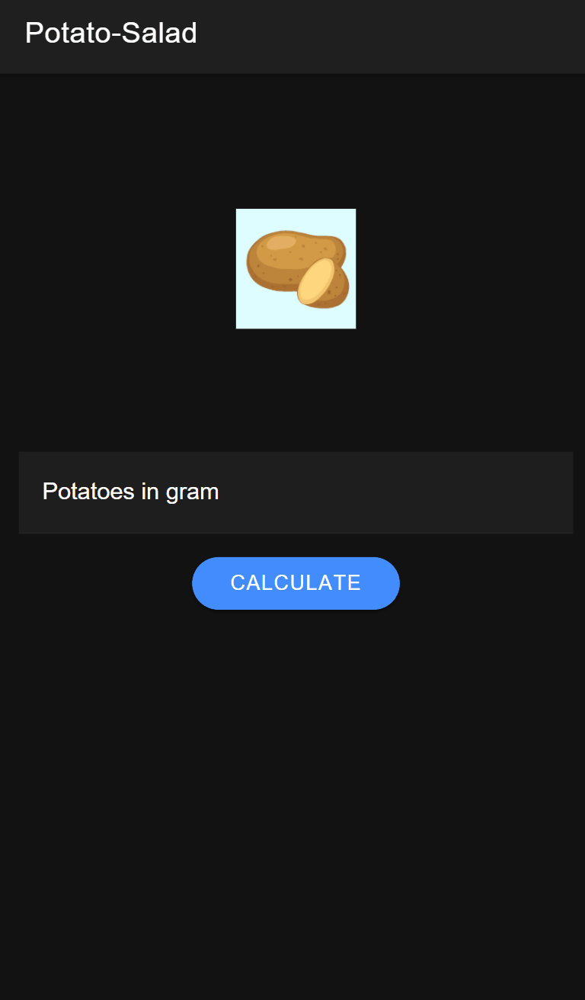

# Potato-Salad-App

## Function

This App provides a recepie for potato-salad calculated on the amount of potatos in grams.

To run the app install the APK on your andorid phone.

Further you can run the project local on your machine.

### Prerequisite

* [Node.js](https://nodejs.org/en/)
* [Ionic](https://ionicframework.com/)

### Installation

Clone the repository to your local machine and run following commands:
```
npm install
```

To install Ionic run:
```
npm install -g @ionic/cli
```

Create your account at https://newsapi.org/ and change the `api-key` in [environments](./app/src/environments/)

To start the app go into te `app`-folder and run:
```
ionic serve
```

This should open the website in your default browser with the URL http://localhost:8100/

## Demo


